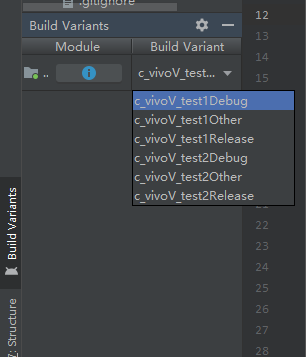

# android studio多渠道打包基础配置

 

android studio使用gradle作为构建工具，这里简单记录一下使用gradle进行多渠道打包的基础知识

## 笔记
笔记是这个：220209_gradle教程笔记

## 配置flavorDimensions
这个是配置多维度，必须配置，可以是一个或多个维度
如果只有1个维度，在productFlavors里可以不指定这个维度，如果有多个维度，必须指定是哪个维度
而且如果有多个维度productFlavors里面的配置必须要每个维度都有所指定，比如你配置了2个维度，但是在productFlavors
里面却只使用了一个，则会报错。
flavorDimensions配置如下：
```Groovy
    flavorDimensions "company", "version"
```
android 3.0只有也可以配置flavorDimensions "default"，这样将不需要在productFlavors配置dimension这个维度，
相当于直接忽略了flavorDimensions，只有productFlavors这个维度了。

## 配置signingConfigs
这个是配置签名文件的，signingConfigs的配置需要在productFlavors前面，否则productFlavors
里面使用signingConfigs会报错
```Groovy
    signingConfigs {
        test1 {
            storeFile file('../jks/test1')
            storePassword "123456"
            keyAlias "key0"
            keyPassword "123456"
        }
        test2 {
            storeFile file('../jks/test2')
            storePassword "123456"
            keyAlias "key0"
            keyPassword "123456"
        }
    }
```
## 配置buildTypes
这里可以理解为编译类型，例如debug，release，当然也可以添加自定义的类型
```Groovy
    buildTypes {
        other {
            debuggable true
            jniDebuggable true
            zipAlignEnabled true
            minifyEnabled false
            shrinkResources false
            proguardFiles getDefaultProguardFile('proguard-android.txt'), 'proguard-project.txt'
        }

        debug {
            debuggable true
            jniDebuggable true
            zipAlignEnabled true
            minifyEnabled false
            shrinkResources false
            proguardFiles getDefaultProguardFile('proguard-android.txt'), 'proguard-project.txt'
        }

        release {
            minifyEnabled false
            proguardFiles getDefaultProguardFile('proguard-android-optimize.txt'), 'proguard-rules.pro'
        }
    }
```
buildTypes常用配置字段的含义：<br/>
debbuggable	否生成一个可调式的apk<br/>
minifyEnabled	打开混淆<br/>
multiDexEnabled	是否可以分包<br/>
proguardFiles	指定插件使用的混淆文件<br/>
zipAlignEnabled	是否使用zipAlign优化apk,Android sdk包里面的工具，能够对打包的应用程序进行优化，让整个系统运行的更快<br/>
shrinkResources 打开资源压缩

## 配置productFlavors
在这里进行配置多渠道
```Groovy
    productFlavors {
        c_vivo {
            dimension "company"
        }

        v_test1 {
            signingConfig signingConfigs.test1
            dimension "version"
        }

        v_test2 {
            signingConfig signingConfigs.test2
            dimension "version"
        }
    }
```
指定dimension，其中这里面配置的渠道必须要覆盖了flavorDimensions指定的dimension,否则会报错
另外在这里指定各个渠道的签名

这样配置完成之后，就可以点击工具栏上面的sync project按钮同步project了，同步完成后可以再Build Variants里面查看
配置的渠道

## 添加debug配置
debug加入debug相关的代码和资源，release则是另外的资源



## 添加多渠道打包用法
1.添加自定义apk文件名
2.复制mapping文件到固定目录，实现备份功能
3.备份aab
4.备份aab mapping文件

## 注意问题
1.添加自定义输出apk文件名的时候，发现执行一次gradlew assembleC_vivoV_test1Release输出文件名后，再次执行不会输出了
然后重新删除app下的build目录，再次执行才可以输出。
可能原因是，打包时app/build/output/apk/c_vivoV_test1/release目录下有个output-metadata.json的文件在文件里面记录了
新的apk路径
      "outputFile": "..\\..\\..\\..\\..\\..\\outputApk\\22_08_12\\Alomet_v1.0_1_2022-08-12_14-00-07_test001_Debug.apk"
打包的时候gradle应该也有这个outputFile的缓存，如果缓存一样，gradle直接就不输出文件了，如果修改上面outputFile的值，
即使不删除build目录，gradle打包也会有新的apk文件输出


## 修改成gradle 8.0遇到问题
1.编译报错  
Namespace not specified. Specify a namespace in the module's build file. 
See https://d.android.com/r/tools/upgrade-assistant/set-namespace for information about setting the namespace.
If you've specified the package attribute in the source AndroidManifest.xml, you can use the AGP Upgrade 
Assistant to migrate to the namespace value in the build file. Refer to https://d.android.com/r/tools/upgrade-assistant/agp-upgrade-assistant 
for general information about using the AGP Upgrade Assistant.
解决办法
在每个module的build.gradle上添加namespace，这个namespac就是AndroidManifest.xml下的package，并且把
AndroidManifest.xml的package去掉
android {
      namespace "com.cold.flavorsdemo"
      ...
}

2.编译报错
Product Flavor 'ayome' contains custom BuildConfig fields, but the feature is disabled.
To enable the feature, add the following to your module-level build.gradle:
`android.buildFeatures.buildConfig true`
解决办法：
在gradle.properties文件中增加
android.defaults.buildfeatures.buildconfig=true

参考文档：
https://blog.csdn.net/zxl1173558248/article/details/131143566


## license

    Copyright 2019 wjianchen13

    Licensed under the Apache License, Version 2.0 (the "License");
    you may not use this file except in compliance with the License.
    You may obtain a copy of the License at

       http://www.apache.org/licenses/LICENSE-2.0

    Unless required by applicable law or agreed to in writing, software
    distributed under the License is distributed on an "AS IS" BASIS,
    WITHOUT WARRANTIES OR CONDITIONS OF ANY KIND, either express or implied.
    See the License for the specific language governing permissions and
    limitations under the License.


